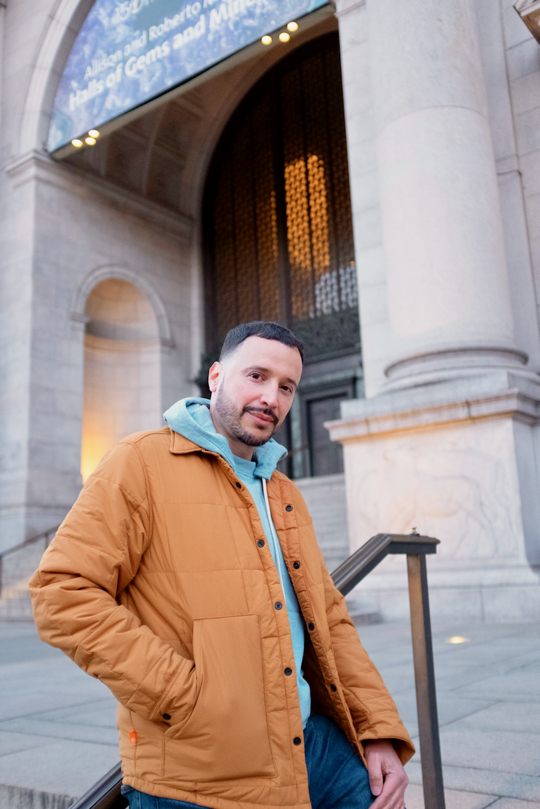

# Freddy Caban
Personal Website

## [Publications and Presentations](https://frcaban.github.io/about) | [Research](https://frcaban.github.io/Research) | [Contact](https://frcaban.github.io/Contact) | [CV](./FreddyCabanCVUpdated.pdf)

I recently graduate from Stony Brook University with my masters degree in physics and advanced graduate certificate in data and computational science. My thesis was "Migration-Coupled Disk of Gas and Stars" where I considered the possibility of a two component active galactic nuclei (AGN) disk where one component consists of the rotating gas along with the possibility of an innger component made up of stars. I am currently a full time employee of the City of New York as a New York City Correction Officer. I obtained my associate of science in mathematics from the Borough of Manhattan Community College CUNY in 2018 and my bachelor of science in physics from Queens College CUNY in 2021. I am a member of the astrophysics research group at the American Museum of Natural History. I have a fascination with the stars and a curiosity to understand the workings of our universe. 

Outside of my studies and work life, I love to travel and plan to do a lot more of that in the near future. There is nothing like exploring other parts of the world and connecting with the history and diverse cultures that paint our world. I love to run and recently ran the New York City marathon which was also my very first marathon. I enjoy working out and do my best to live a healthy and positive lifestyle. I love nature and the outdoors as well as eating good so trying new restaurants is always fun.

